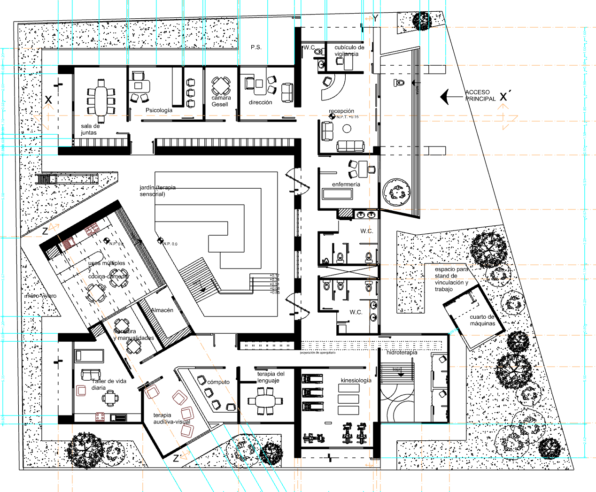
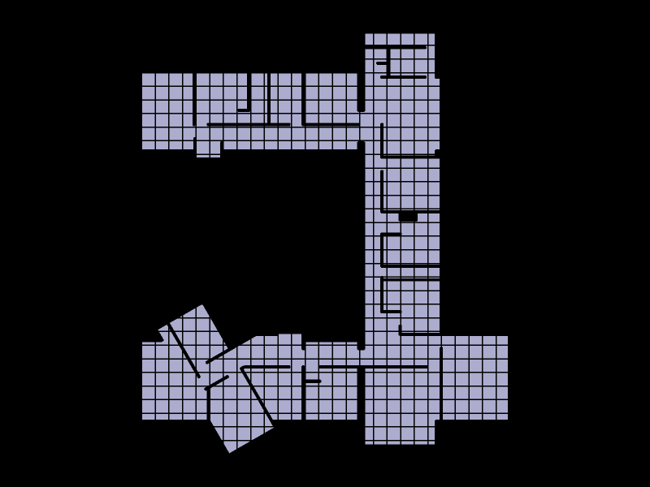
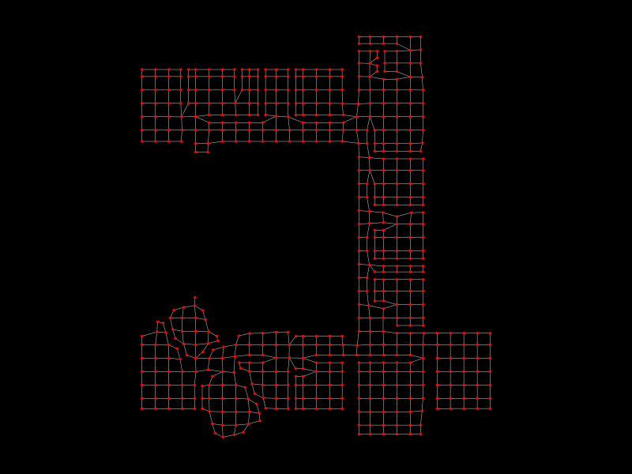
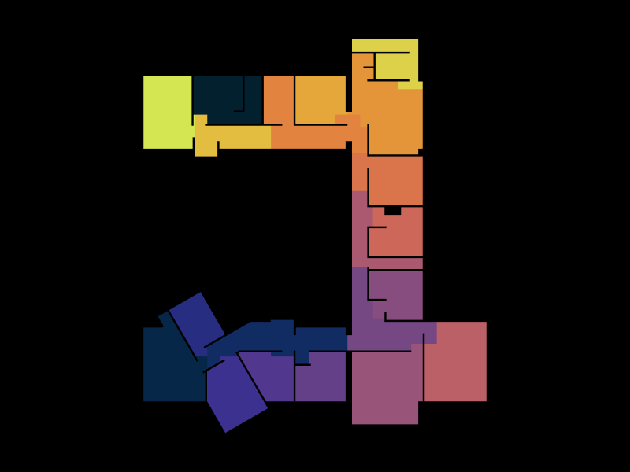
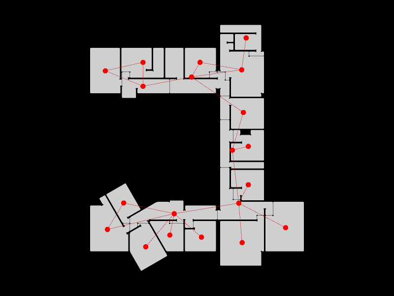
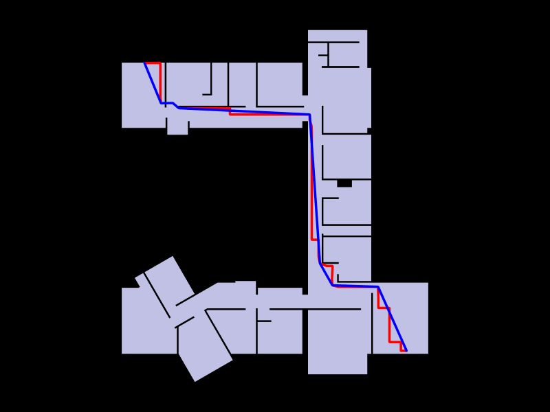
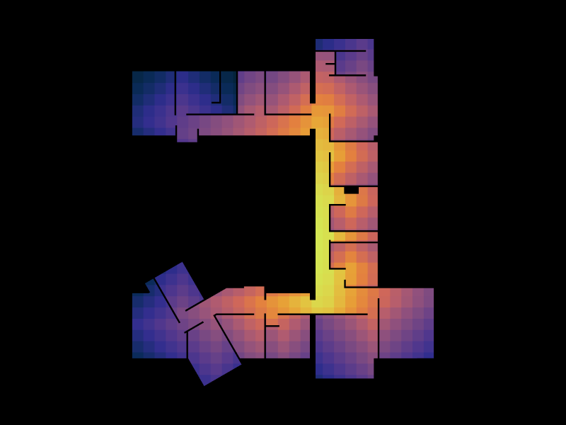
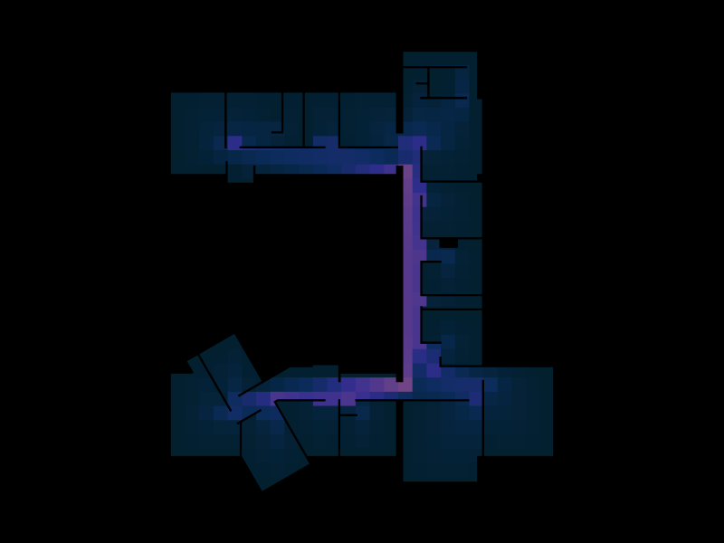
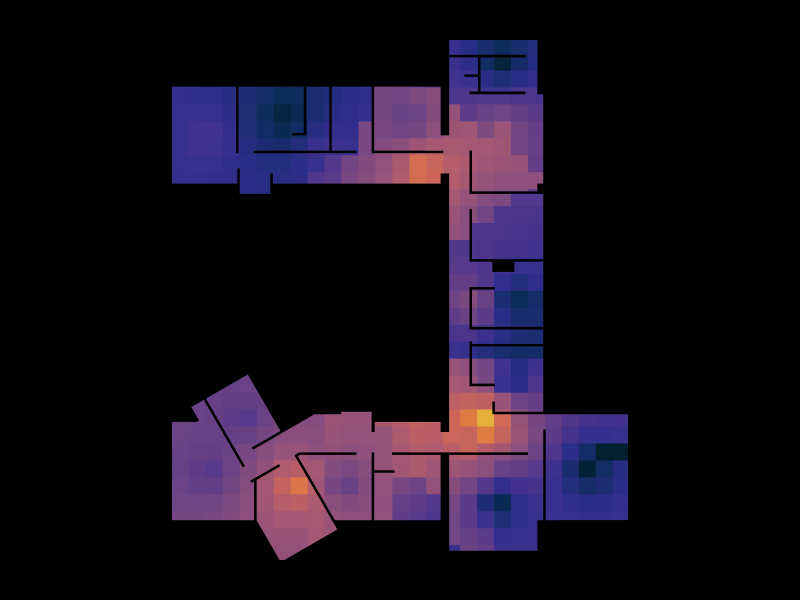

# Graph-Based Analysis of the FloorPlan of a Care Center for Children with Autism

## Introduction
This research employs TopologicPy, a spatial design and analysis Python library, to construct and analyse graphs that demonstrate the potential of graph‑based methods in assessing how well the spatial configurations of autism centres align with autism‑friendly design principles.

## Related Work
This work was motivated both by the author’s interest in autistic‑friendly design and by the precedent research conducted by Dania H. Al‑Harasis and Wassim Jabi at the Welsh School of Architecture, Cardiff University.

Their findings were published in the paper “Graph‑based Analysis of Best Practices in Autism Centre Design,” which investigates how graph‑based analysis can be applied to evaluate the spatial configuration of autism centres.

## Methoology

### From grid to graph

First, the imported BREP was cleaned to remove triangulation. The cleaned floorplan was then sliced with a 1 m × 1 m grid to generate a shell. This shell was converted into a graph —figure below— which serves as the starting point for the spatial analysis.

Centrality values were calculated for each graph vertex and subsequently transferred to the shell faces for visualisation.

### Closeness and Betweenness Centrality
Closeness centrality was calculated to assess spatial accessibility and circulation efficiency within the layout.Additionally, betweenness centrality was computed to measure the degree to which each node functions as a critical connector within the graph.

### Degree centrality
Degree centrality was calculated to evaluate the connectivity of each space, representing the number of direct links each space maintains with others.

The first step involved retrieving communities—i.e., rooms—from the floorplan. As shown in the figure below, the results are largely accurate, with only two rooms merging with portions of the corridor.

A new shell was then generated, containing one face per room/community, and converted into the graph below.

After computing degree centrality for each node, the results were first interpolated back onto the original graph and then transferred to the shell for visualisation.

## Results and analysis

### Shortest path
The longest shortest path—representing the maximum distance required to move between two points in the building—is approximately 42 m, which is relatively long given the modest size of the facility.

This metric is particularly relevant in autism‑friendly design: long walking distances may contribute to fatigue, sensory overstimulation, and challenges for users with limited mobility.

A radial layout typology could have significantly reduced travel distances, though potentially at the cost of creating congested or overstimulating nodes.

### Closeness centrality
Closeness centrality indicates that the building is highly navigable: reception, nursing, and sanitary spaces are all easily reachable from the central corridor.

One lateral branch efficiently serves the therapy rooms and laboratory, while the opposite branch connects to the head office, meeting room, and psychological support room.

No space is isolated or requires long or indirect routes, confirming a coherent and legible circulation structure.

### Betwenness centrality
Betweenness centrality reveals that all rooms are accessible through dedicated circulation routes without requiring passage through other programmatic spaces. 

This reduces noise, unpredictability, and unwanted encounters—key considerations in autism‑sensitive environments.

It also highlights a privacy gradient: the corridor leading to the head office, meeting room, and psychology functions as a more secluded branch compared to the others.

### Degree centrality
Degree centrality shows that the sanitary and therapy rooms are among the most private spaces, with fewer direct connections, followed by the head office.

Conversely, the southern portion of the circulation spine emerges as the most interconnected area. Reception, laboratory, and nursing spaces exhibit medium connectivity, making them easy to reach while maintaining functional separation.

## Conclusions
The analysis demonstrates that intuitive circulation supports clear accessibility throughout the building while intentionally secluding therapeutic rooms as low‑stimulation, controlled environments.

Overall, the centrality patterns illustrate the balance required in autism‑friendly design: ensuring predictable, well‑connected routes without compromising the protected character of sensitive spaces.

## Future work
